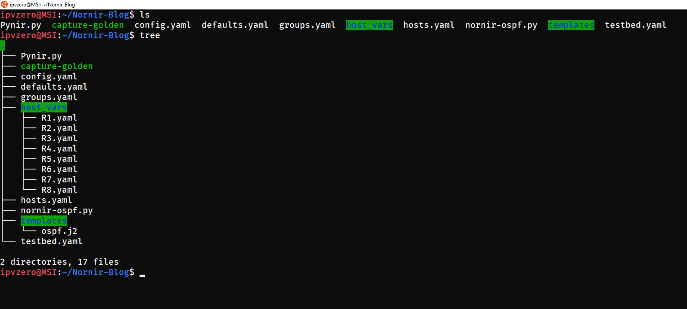
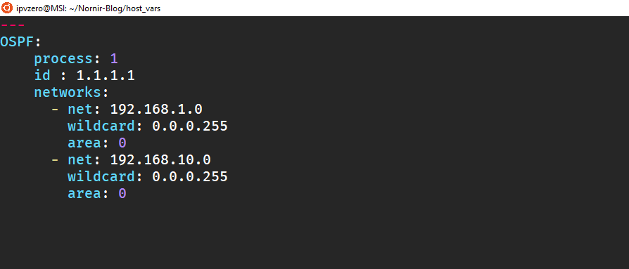
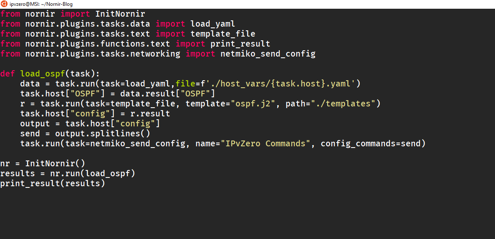
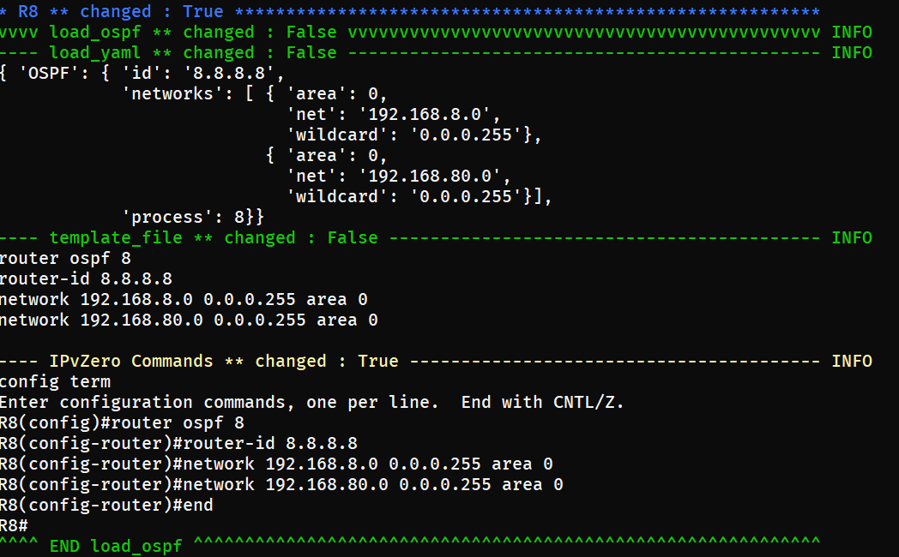
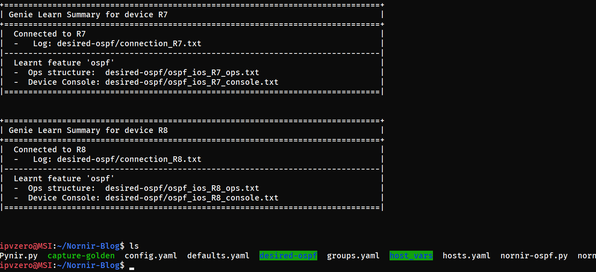
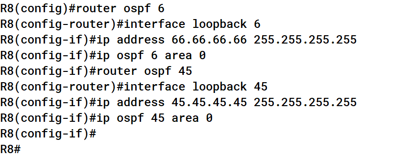
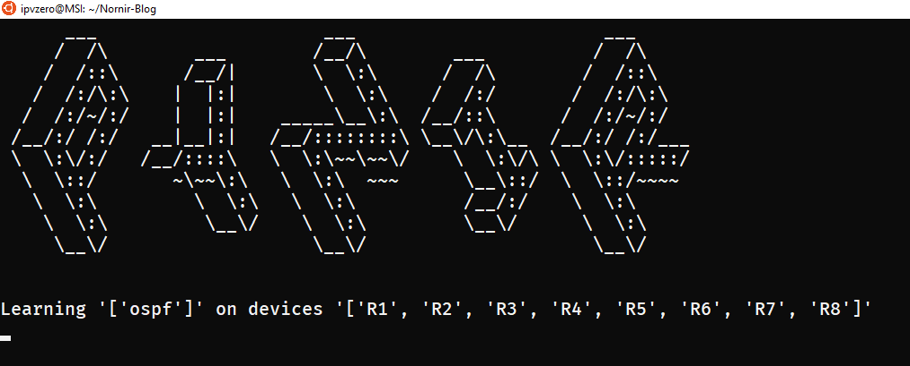
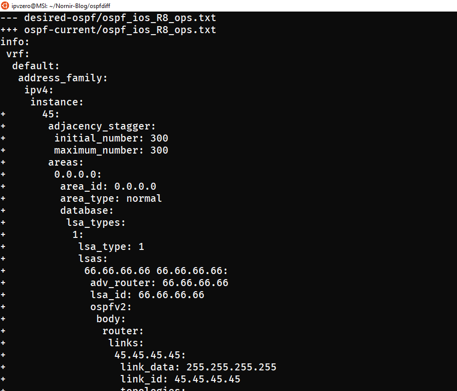
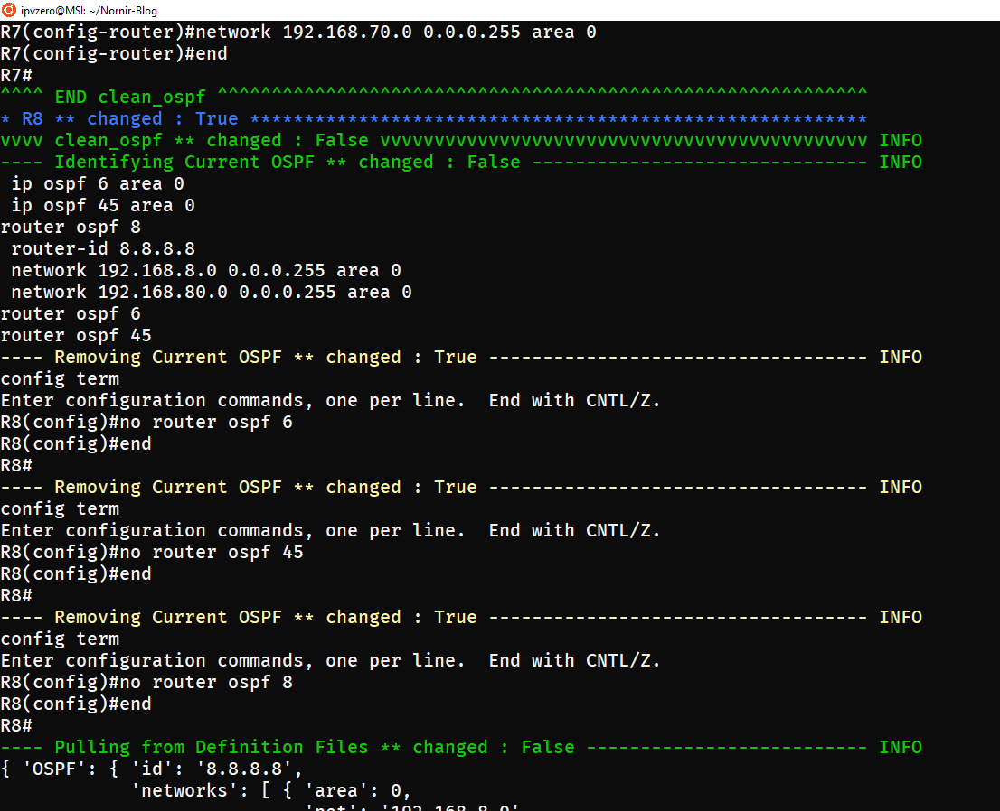
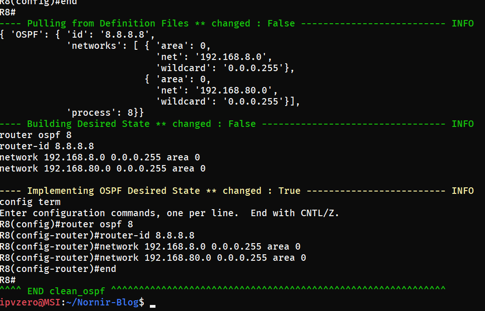

# Nornir & pyATS

This tutorial aims to provide a simple use-case for combining Nornir and pyATS together in order to profile your current network configurations and implement desired state - as specified in host variable definition files.

The workflow we will follow in this tutorial will be first:

- Deploy OSPF desired state using Nornir
- Immediately deploying pyATS to capture a golden image profile of this &quot;desired state&quot;
----------------------------------------------------------------------------------------------------

After we have conducted the initial steps we like then deploy a python script (Pynir.py) that will:

- Invoke pyATS to profile the current OSPF configuration and compare it to the golden image previously captured.
- If pyATS detects a difference – the terminal will prompt an alert signalling that OSPF in currently out of sync with desired state
- The script will then give the user the option to rollback to desired state
- Should the user answer No – the script ends and all OSPF Currents settings and Diff artefacts are left and are able to be inspected
- Should the user answer Yes – the script invokes Nornir to first erase all OSPF configurations currently in the network before reimplementing desired state by pulling information from host variable definition files and using jinja2 templates.
- Lastly, if the script detects that the current OSPF profile is identical to the OSPF desired state, a message

To begin, let&#39;s first look at the directory structure and setup:

As you can see we can our basic Nornir yaml files:

- _hosts.yaml_
- _groups.yaml_
- _defaults.yaml_

As well as a &quot;_testbed.yaml_&quot; file to allow pyATS to connect into and profile the network. Next, you&#39;ll notice we also have two directories. The first one called &quot;_host\_vars_&quot; which will house our OSPF host variables (note: you can use the _hosts.yaml_ file instead, but I have chosen to create a separate directory to perform this task). The second is called &quot;_templates_&quot; which will house our OSPF Jinja2 template.

Importantly, you&#39;ll notice a &quot;_capture-golden_&quot; file. This is a very simple bash script used to capture our &quot;golden&quot; snapshot of our desired OSPF state. It simply executes a pyATS command. You can type this command by hand should you wish, but since the output directory has to remain the same since it will be referenced by the _Pynir.py_ script – for consistency, I have elected to execute it from a bash script to prevent me mistyping the output destination. Let&#39;s use Vim and look inside to see what&#39;s going on:

As you can see the bash script simply tells pyATS to learn the network&#39;s OSPF configurations and save the output into a directory called &quot;_desired-ospf_&quot;. This directory will act as our reference point.

Let&#39;s take a look inside the _host\_vars_ directory and see what our host variable definition files look like. For brevity, let&#39;s just look at _R1.yaml_:

We have a very basic OSPF setup which lists the process ID number, the RID, and the network statement configs for the router. R2 through to R8 have very similar configurations. As this is simply a demo, I have created easily identifiable variations between files. For example, R5 uses OSPF process ID of 5, with a RID of 5.5.5.5 and the networks it advertises are &quot;192.168.5.0&quot; and &quot;192.168.50.0&quot;. These files represent our desired state. In other words, this is what our network &quot;should look like&quot;.

Next, let&#39;s look inside the templates directory and open our _ospf.j2_ file:

This template will simply access the Keys inside of our host\_var yaml files and populate the template with their corresponding Values to build our desired OSPF configuration.

You will notice we have a _nornir-ospf.py_ script. This is the script we will use to first initially push our desired state onto the routers. This script simply pulls desired state from our _host\_vars_ and pushes them through our Jinja2 template onto the network. In other words, it does not remove old stale configs (like _Pynir.py_ will) so the assumption here is that we are working with a blank slate on the devices. Let&#39;s look inside the script:

This is a fairly typical script which will pull information from the desired state specified in our _host\_vars_ yaml files, save the information and use those values to build our configurations based in the syntax specified in our Jinja2 template. Nornir then invokes Netmiko to push those configurations out to all of our respective devices in the network. Now that we understand what&#39;s going on, let&#39;s execute that script and push our desired state onto our otherwise blank network:

With our desired state now present on the network, let&#39;s immediate use pyATS to build a detailed profile of that configuration and grab our &quot;golden&quot; snapshot. Let&#39;s execute the _capture-golden_ script:

pyATS has successfully profiled our desired state and you will notice the addition of a new directory called &quot;_desired-ospf_&quot; which houses of all of our detailed OSPF information for each device. 
Now that we have pushed our desired state and successfully created a snapshot for future comparison, let&#39;s look at the main script which we will use for our OSPF management going forward, &quot;_Pynir.py_&quot;. The script is relatively long so let&#39;s break it down into sections. First we begin with our imports - and I have also included a Pyfiglet banner for purely aesthetic purposes (who doesn&#39;t like to make their scripts pretty, right?).

Next, we create a custom function called &quot;_clean\_ospf_&quot;. The first challenge of the script was to find a way to strip away all OSPF configurations, should that be required. The problem with automating over legacy devices with no API capabilities, however, is that we are heavily reliant on screen-scraping – an inelegant and unfortunately necessary solution. To do so, I made the decision to use Nornir to execute a &quot;_show run | s ospf_&quot; on all devices, saved the resulting output, and began screen-scraping to identify digits in the text. The aim here was to identify any OSPF process IDs which could then be extracted and used to negate the process by executing a &quot;_no router opsf_&quot; followed by the relevant process ID. The challenge here is that the show command output would also include area ID information – and OSPFs most common area configuration is for area 0. Of course &quot;_router ospf 0_&quot; is not a legal command, so in order to avoid this I included a conditional statement that would skip over and &quot;continue&quot; past any number zeros in the output. The second challenge would be avoiding needless repetition. Should OSPF be configured via the interfaces, the resulting show output could, for example, have multiple &quot;_ip ospf 1 area 0_&quot;, &quot;_ip ospf 1 area 0_&quot;, etc. Parsing out the this information could lead to the script executing multiple &quot;_no router ospf 1_&quot; commands which is, of course, unnecessary. To avoid this, I elected to push all output into a python list, and from there remove remove all duplicates. There is still, however, an inefficiency given that the show output could, for example, show a multi-area OSPF configuration all within the same process. This could result in a script seeing an &quot;_ip ospf 1 area 5_&quot; configurations and attempting to execute a superfluous &quot;_no router ospf 5_&quot;. However, given that the script has protections against repetitive execution, and that routers will have limited areas configured per device (maybe 3 different areas at most per device, if at all), I made the decision that this was an acceptable inefficiency. Like I say, there is nothing elegant about screen-scraping and sometimes a 90% solution is better than no solution:

Now we have the ability to remove all current OSPF configuration, we create a custom function called &quot;_desired\_ospf_&quot;. This is almost identical to the earlier script and simply builds our configuration from host\_vars definition files and pushes them through our jinja2 OSPF template and out to the devices:

The next part of the script is effectively what executes first and precedes our two custom functions (with will only execute upon certain conditions). Let&#39;s look at it. First we use the OS and Subprocess python modules to first execute the shell command &quot;_pyats learn ospf --testbed-file testbed.yaml --output ospf-current_&quot; to relearn the current state of the network&#39;s OSPF configs, and then running a diff between the current configs, and our previously saved golden config – &quot;_pyats diff desired-ospf/ ospf-current –output ospfdiff_&quot;. We then read the output and search for the string &quot;_Diff can be found_&quot;. If a difference is found, we are alerted to the discrepancy and offered the choice to rollback to our desired state.

Should we answer &quot;y&quot; and affirm our decision to rollback, the script will first remove all current ospf and diff artefacts before calling our &quot;_clean\_ospf_&quot; custom function, which, in turn, calls our &quot;_desired-ospf_&quot; function and prints the output.

Should we choose **not** to rollback, however, and instead want to inspect those changes in detail - by selecting &quot;n&quot; the script simply terminates and leaves all artefacts for our inspection.

Lastly, should the script detect no changes between the current state of our OSPF network and the configurations in our golden capture – the script simply ends and informs us that all OSPF configurations are matching desired state:

------------------------------------------------------------------------------------------------------------------------------
## Demo - Let's Break The Network!

Now that we understand the logic of the script, let&#39;s perform a demo and see the workflow in action. Now remember, we have already deployed our initial desired state and captured that snapshot using both the _nornir-ospf.py_ and _capture-golden_ scripts. Let&#39;s first &quot;break&quot; the network by adding some unwanted OSPF configurations on R8:

Now the current state of our OSPF network does not match the configuration specified in our desired state. Let&#39;s run the _Pynir.py_ script and see if it detects the change. _Pynir_ first starts learning the current OSPF configurations:

The change is detected and we are both notified and given the option to rollback. This time, we first want to inspect the changes, so let&#39;s answer &quot;n&quot; for No:

The script terminates and leaves the relevant artefacts which we are free to inspect (notice the new directories _ospf-current_ and _ospfdiff_):

We can now freely examine these changes and decide if we want to erase them by performing a rollback, or leave them and updating our OSPF definitions:

Upon examination it is clear now that these configuration are certainly not meant to be present in the network. We then rerun Pynir, this time choosing &quot;y&quot; to rollback to our desired state:

This selection triggers Nornir to execute our custom functions that remove all current OSPF configs and artefacts before redeploying OSPF as specified in our host\_var definition files.

First the OSPF configurations are identified by the show output, and then negated:

Pynir then pulls out desired state from our host varables, builds our configuration using the Jinja2 template, and pushes out the config: 

For our final validation, let&#39;s rerun the script and ensure that we are now in compliance with our desired state:

Excellent! Everything is back to the way it should be.

As you can see, combining Nornir with pyATS can allow us to easily monitor and rollback our network to ensure we are compliant with our desired state of the network. As demonstrated, the largest challenge was finding a workaround to remove all undesired OSPF configurations. With modern devices with APIs, with options for candidate configurations, etc, this problem vanishes. Unfortunately, however, we still need to deal with older devices that were not built with automation in mind, and we have to create inventive and sometimes inefficient workarounds to solve a particular problem. This script is an attempt at doing that.

You can download the script and all subsequent configurations at:

[https://github.com/IPvZero/pynir](https://github.com/IPvZero/pynir)

You can find me on [https://twitter.com/IPvZero](Twitter)
